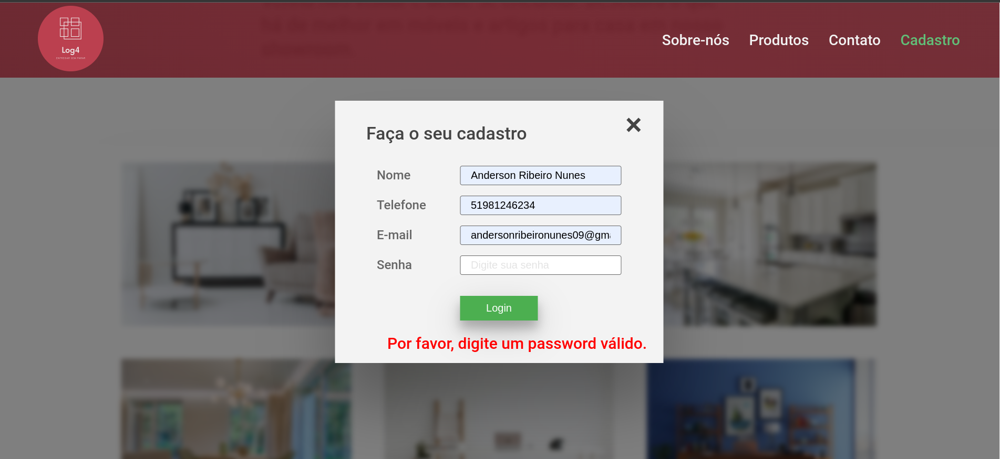

## Resumo do projeto

_Landing Page_ foi um projeto desenvolvido na escola de programação web full stack [Labenu](https://www.labenu.com.br/).

Nesse projeto, o objetivo era criar uma _Landing Page_, ou seja, um site de apenas uma página para atrair clientes e despertar curiosidade e interesse nos serviços e/ou produtos de uma empresa.

A partir disso, a Labenu disponibilizou uma lista de empresas fictícias da qual escolhi a _Log4_ para desenvolver sua Landing Page.

#### A Log4

A Log4 é uma empresa de uma grande varejista que, após liderar o mercado de móveis, cama, mesa e banho, resolveu entrar no mercado puro de logística para competir com empresas como Loggi e MadeiraMadeira. Seus dois principais produtos são (i) a distribuição rápida de itens pequenos via motoboys/ciclistas e (ii) a distribuição rápida de móveis ou itens de grande tamanho. Você precisa criar um site capaz de comunicar a tradição e confiança do grupo varejista, mas também se posicionar como uma nova solução de tecnologia que traz velocidade aos clientes.

[Logo aqui](https://labenu.notion.site/Projeto-Landing-Page-WFS-7b37ff1460e741b1b5e1e049d7df9d69)

## Estas foram os itens de requisitos para o projeto

A sua Landing Page deve conter:

- [ ] **Uma seção inicial ou principal:** Esta é a seção que visitantes vêem primeiro quando acessam seu site.
- [ ] **Logomarca:** A logomarca fornecida pelo cliente, que deve ser apresentada de forma clara e em um local estratégico da página.

- [ ] **Paleta de cores:** Uma paleta de cores baseada na logomarca fornecida pelo cliente.

- [ ] **Cabeçalho e Rodapé:** O cabeçalho deve conter informações importantes sobre a sua empresa, como botões de navegação e opções de contato. Já o rodapé pode incluir informações adicionais, como endereço e links de redes sociais.

- [ ] **Redes Sociais:** Incluir pelo menos 2 ícones para redes sociais, visíveis e clicáveis.

- [ ] **Formulário de Contato:** Inclua um formulário de contato para que os visitantes possam se comunicar com a empresa fictícia. O formulário deverá solicitar, no mínimo, um e-mail para contato.

- [ ] **Responsividade:** Sua landing page deve ser responsiva e adaptável a diferentes tamanhos de tela, como smartphones e desktops. Além disso, é importante testar sua landing page em diferentes dispositivos, como o iPhone 6/7/8 para a versão mobile, e em uma tela de 1280px de largura para a versão desktop.

- [ ] **Botões:** Todos os botões devem estar funcionando com alguma lógica javascript.

- [ ] **Seções:** Conter, pelo menos, 2 seções diferentes.

   
Sugestões de Seção (você não precisa se limitar a elas)

    * Quem somos
    * Nossos produtos/serviços
    * Contato
    * Nosso time
    * Trabalhe conosco
    * Cases de sucesso
    * Onde estamos
    * FAQ/Perguntas Frequentes
    * Promoções

link surge: http://irritating-health.surge.sh

## Desktop

## Desktop formulário

## Mobile

